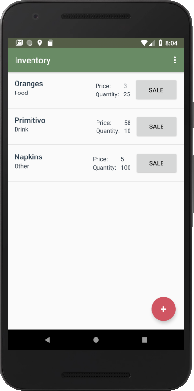
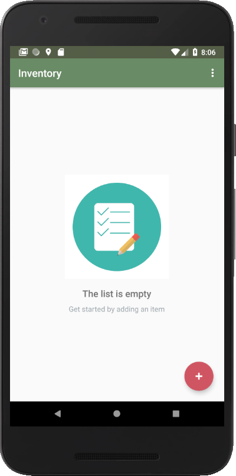
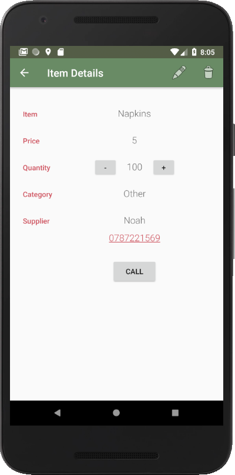
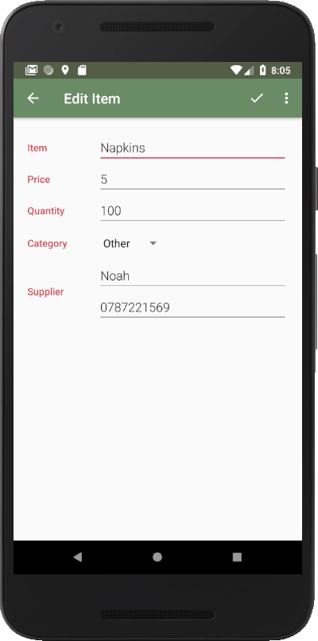

Inventory
==========

[Click here to see the app in action](https://www.youtube.com/watch?v=bKWdDiIfqGU).

	<table align="center" cellspacing="0" cellpadding="0" style="border: none; border-collapse:collapse">
		<tr>
			<td align="center"></td>
			<td align="center"></td>
		</tr>
		<tr>
			<td align="center"></td>
			<td align="center"></td>
		</tr>
	</table>

[Back to Home](index)
