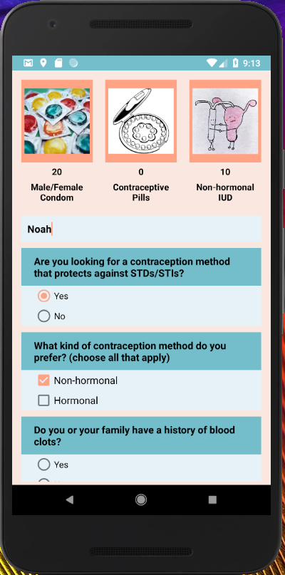
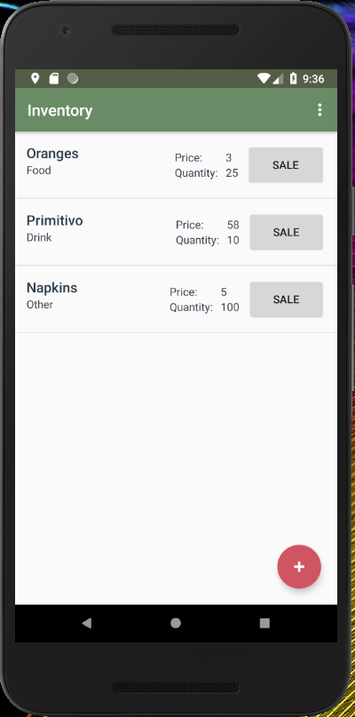
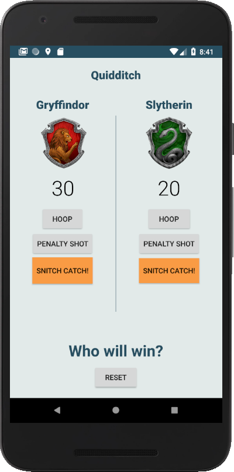
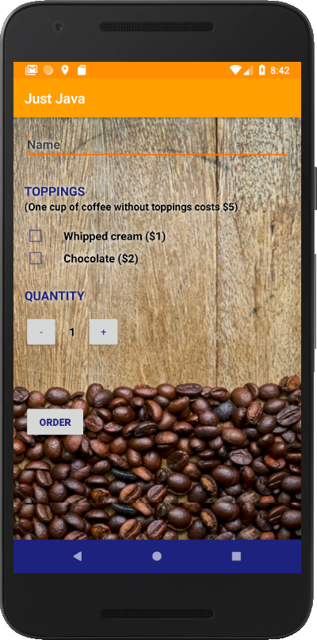
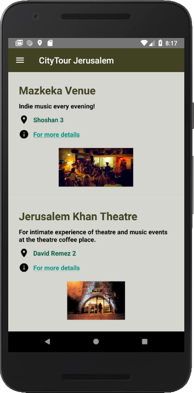

# Noah Beerova
Motivated, lost.

Contraceptive methods questionnaire
=======================================
As a woman and a social worker who used to work with adolescents.
In this app I wanted to combine my knowledg of contraception methods and programming.
The way every answer influences the final result is visible through the points counter underneath every image,
to help the user understand what lead to the final suggected contraception method suggestion.

[Click here for more images](bcquizGallery)

  

Inventory
=========
In an attempt to contribute to my work place, 
the inventory app is addapted/tailored to the use of a restaurant.
With the possibility to add and edit any product in a fast and easy way.
Making the task of keeping track of the inventory easier.
Making the app helped learn how to use a database.
 
[Click here for more images](InventoryGallery)

Quidditch
=========
animation, responsive

[Click here for more images](QuidditchGallery)

Just Java
=========
intent
learning how to connect the app that I am building to other apps on my phone,

[Click here for more images](JustJavaGallery)

City tour
=========
Jerusalem is my home town.
Using few fragments and one menu I tried to build a simple app for the use of tourists, new students,
young and senior residents

because there is always something new to learn or find in this amazing city.

[Click here for more images](CityTourGallery)

