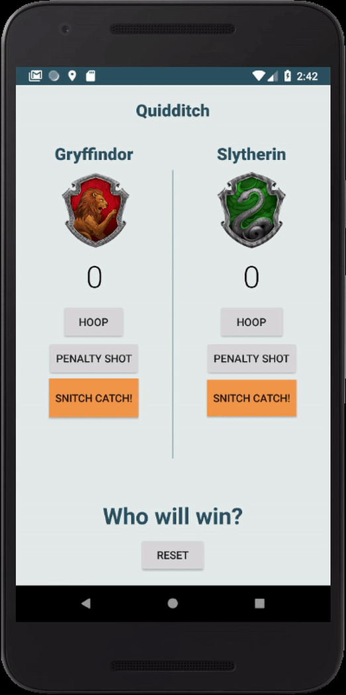

# Noah Beerova
Social worker at the core. 
Inspired by opportunities to improve; striving for simple, practical and intuitive solutions.

Contraception Quiz
===================
Answer the questions to find out which contraception method could be good for you. 
As a woman and a social worker who used to work with adolescents, sexual education is a big part of my life.
In this app I wanted to combine my knowledge of contraception methods, responsive UX and programming.
The way every answer influences the final result is visible through the point counter underneath every image,
to help the user understand what led to the final contraception method suggestion.

[Click here for more images](bcquizGallery)

	

Inventory
==========
In an attempt to contribute to my workplace, 
this inventory app is tailored to the use of a restaurant.
With the possibility of adding and editing any product, the app makes the task of keeping track of the inventory easier.

[Click here for more images](InventoryGallery)

	

Just Java
=========
An easy way for a business to get orders from its customers. 
The "Just Java" app is an example of a simple ordering app that every business can adapt and use according to its needs.
Building this app, I gained experience working with an _explicit intent_, which allows an app to connect with other apps on the same mobile phone.

[Click here for more images](JustJavaGallery)

	

City Tour
=========
Tourism has a lot of influence on a city, bringing visitors and creating jobs.  
Using a few fragments and one menu I built a simple app for the use of tourists, new students and residents in the city of Jerusalem (my home town).  
The app points out attractions, gives information about them and allows the users to navigate using Google Maps.

[Click here for more images](CityTourGallery)

	

Quidditch
=========
Sometimes apps are just for fun.
In this app my goal was to learn how to build fluid animations using a _ConstraintLayout_.

[Click here for more images](QuidditchGallery)

	

